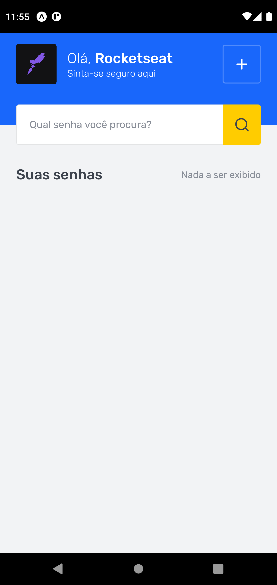
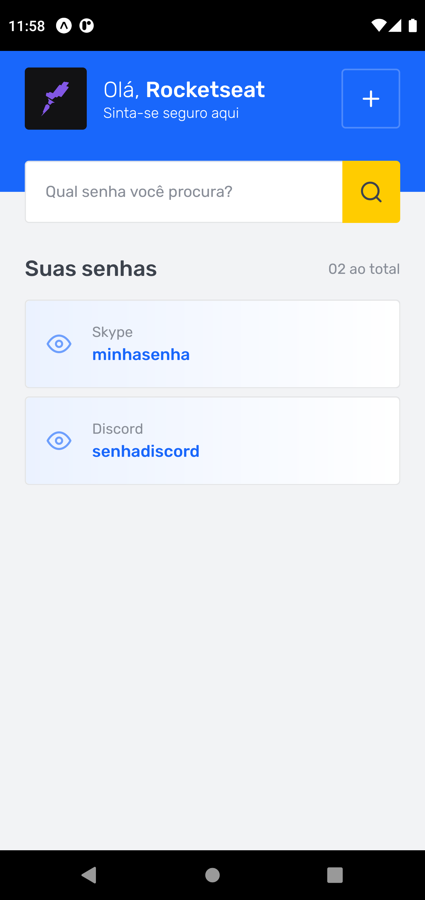
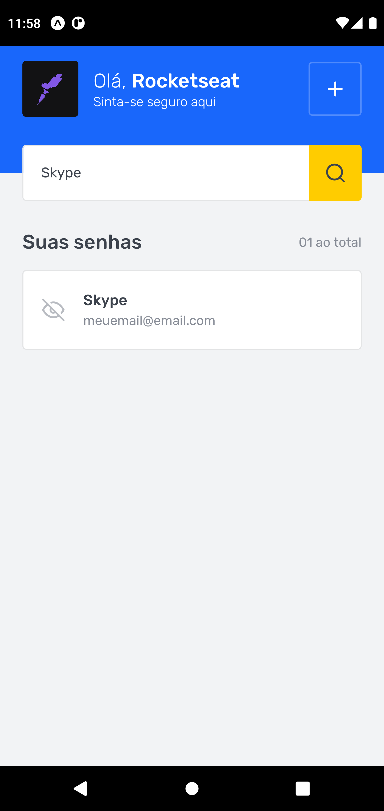

<p align="center">
  
</p>
<h3 align="center">
  Suas senhas mais seguras do que nunca!
</h3>

<br>

<p align="center">
  
  
  
  
</p>
<br>

<p align="center">
  <a href="#sobre">Sobre</a> •
  <a href="#savepass">SavePass</a> •
  <a href="#instalação">Instalação</a> •
  <a href="#tecnologias">Tecnologias</a> •
  <a href="#autor">Autor</a>  
</p>

<br>

## Sobre

Aplicação desenvolvida na trilha de React Native no bootcamp Ignite da RocketSeat. Foi um desafio proposto para consolidar os conhecimentos passados durante um dos módulos do curso.

## SavePass

O SavePass é uma aplicação feita em React Native cujo objetivo é armazenar senhas de diversas plataformas em um só lugar. Ao acessar o app o usuário verá a tela abaixo onde as senhas cadastradas serão exibidas:



No exemplo abaixo podemos ver que duas senhas foram cadastradas pelo usuário, sendo uma do Skype e outra do Discord:



No exemplo acima, percebe-se que ambas as senhas estão sendo exibidas pois o indicador de visibilidade está azul. O padrão seria mostrar apenas o email vinculado as contas cadastradas, conforme veremos na proxima tela.

Além do cadastro de senhas que é realizado ao clicar no botão no canto superior direito, o usuário também tem acesso a uma barra de busca para filtrar suas senhas e encontrar mais facilmente a senha que deseja:



Apesar de simples, a aplicação corresponde ao propósito dela e possui um fluxo e interface bastante simples. Para ilustrar tamanha facilidade deixarei uma demonstração do app abaixo explorando todas as funcionalidades do app:


## Instalação

Antes de começar, você vai precisar ter instalado em sua máquina as seguintes ferramentas:
[Git](https://git-scm.com), [Node.js](https://nodejs.org/en/).
Além disto é bom ter um editor para trabalhar com o código como [VSCode](https://code.visualstudio.com/).

### 📱 Rodando o App

```bash
# Clone este repositório
$ git clone git@github.com:MrRioja/savepass.git

# Acesse a pasta do projeto no terminal/cmd
$ cd savepass

# Instale as dependências
$ npm install
# Caso prefira usar o Yarn execute o comando abaixo
$ yarn

# Execute a aplicação
$ yarn start

# Será aberto no terminal o menu do Expo onde poderá scanear o QR Code para executar o app diretamente no seu celular ou as opções de executar no emulador android ou iOS
```

## Tecnologias


<br><br><br><br>

## Autor

<div align="center">

<h1>Luiz Rioja</h1>
<strong>Backend Developer</strong>
<br/>
<br/>

<a href="https://linkedin.com/in/luizrioja" target="_blank">

</a>

<a href="https://github.com/mrrioja" target="_blank">

</a>

<a href="mailto:lulyrioja@gmail.com?subject=Fala%20Dev" target="_blank">

</a>

<a href="https://api.whatsapp.com/send?phone=5511933572652" target="_blank">

</a>

<a href="https://join.skype.com/invite/tvBbOq03j5Uu" target="_blank">

</a>

<br/>
<br/>
</div>
